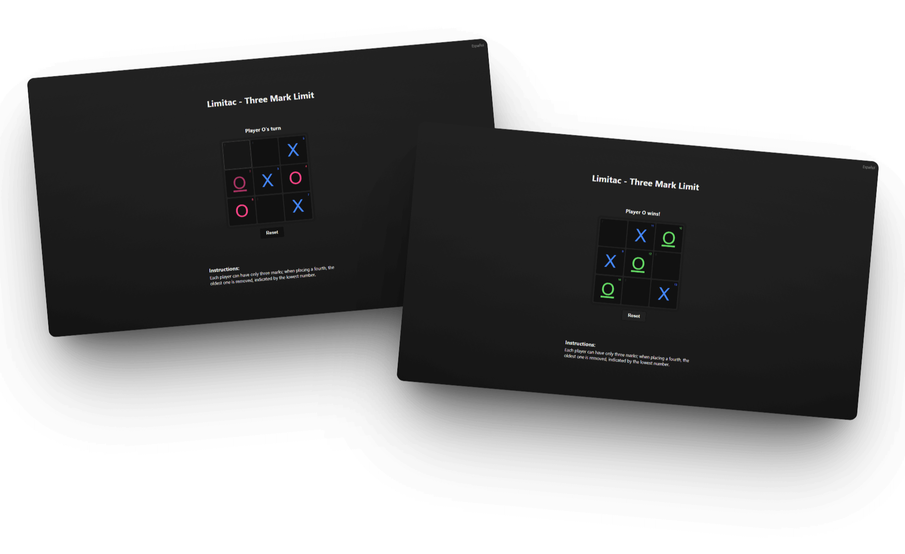

# Limitac

**Limitac** is a variation of the classic Tic Tac Toe game with additional rules that introduce strategy and limitations. It is built using HTML, CSS, and JavaScript.

## Features

* Classic 3x3 Tic Tac Toe board
* Custom game rules:

  * **Move Number Display**: Show the order in which marks were placed.
  * **3-Mark Limit**: Each player can only have 3 marks on the board. Placing a 4th removes the oldest one.
  * **Move Limit**: Players can only place marks adjacent to the previous move.
  * **Time Limit** (in development): Forces random placement if the player takes too long.
* Language Support: Spanish and English versions available
* Game state is saved on page unload and restored on reload

## How to Use

1. Open `index.html` in a web browser.
2. Use the "Options" panel to toggle game rules.
3. Click on any cell to place your mark.
4. Click "Rest" to restart the game.
5. Press number keys 1-9 to quickly focus on a cell.

## Project Structure

* `index.html` - Main HTML structure and UI
* `style.css` - Styling for the game interface
* `main.js` - Game logic, rule enforcement, and interactivity

Enjoy playing with strategic twists in Limitac!

## Screenshots

---

## Author

Created by **KalefXD9876**

## License

This project is open-source. Feel free to modify and share it.

---

> [!IMPORTANT]
> This repository is just a demonstration of my learning in JavaScript and web development. Any advice or suggestions for improvement are very welcome!