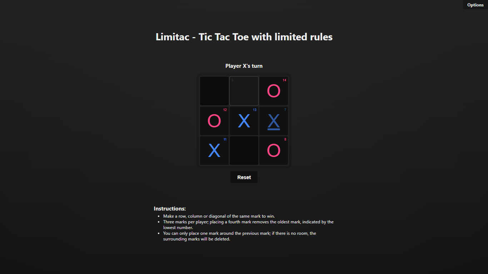

# Limitac
Un HTML; un CSS y un JS para un Tic Tac Toe con una nueva regla que limita la cantidad de marcas en el tablero.

Juegalo aquí: https://kalefxd.github.io/Limitac

## Instrucciones nuevas del juego:
- Cada jugador solo puede tener tres marcas (X u O) en el tablero a la vez. (Sólo pueden haber 6 marcas en total en el tablero)
- Cuando un jugador ya tiene tres marcas y quiere hacer una nueva jugada, automáticamente se elimina su marca más antigua del tablero. (Cada marca muestra un pequeño número que indica el orden en que fue colocada, la más antigua cambiara de color, para que los jugadores puedan saber cuál será la próxima en ser eliminada)

---

## Capturas
| Turno de la casilla 2 de X | Juego ganado por X |
|----------------------------|--------------------|
|  |  |

---

> [!IMPORTANT]\
> Este repositorio es solo una muestra de mi aprendizaje en JavaScript. No me esforcé demasiado en el diseño, ya que mi enfoque principal es mejorar mis habilidades de programación. Estoy aprendiendo con la ayuda de la inteligencia artificial.
> 
> Si tienes algún consejo o sugerencia para mejorar, no dudes en decirmelo. ¡Gracias!
